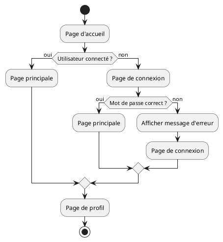

# Pokemon

Ce projet est le fruit de notre travail pour le projet de Technologies Web Serveur (L2)
(** N.B. Ce README ne constitue pas le rapport du projet. Le rapport en format pdf a été rendu a coté du code du projet**)

